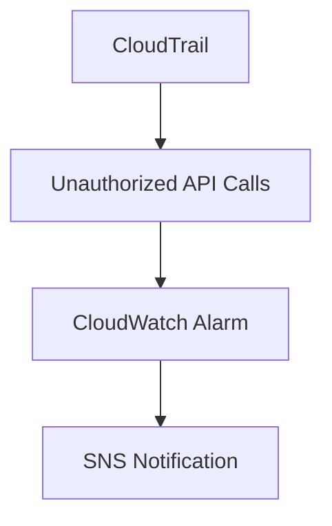

# Alarm Baseline Module

## File Overview
Manages AWS CloudWatch alarms for security baseline monitoring. Contains configurations for critical security metrics like unauthorized API calls and root account usage.

## Resources
### cloudwatch_metric_alarm (unauthorized_api_calls)
- **Purpose**: Monitors unauthorized API calls across AWS account
- **Parameters**: 
  - `metric_name`: "UnauthorizedAttempts"
  - `comparison_operator`: "GreaterThanThreshold"
  - `threshold`: 0
- **Relationships**: Integrates with AWS CloudTrail and IAM services

## Use Cases
- Detect suspicious API activity in real-time
- Trigger SNS notifications for security team alerts

## Dependencies
- `aws_cloudtrail.tf` for API call logging
- `aws_sns_topic` resource for alert notifications