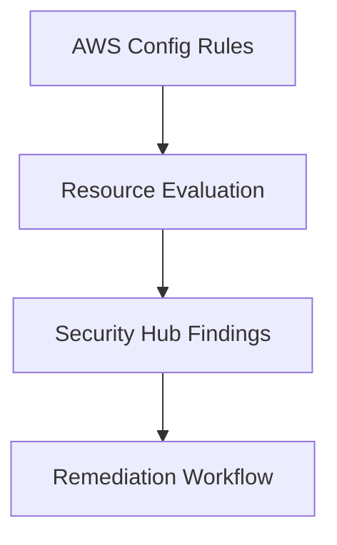

# Analyzer Baseline Module

## File Overview
Manages AWS Config rules and security hub integrations for continuous compliance monitoring. Implements foundational security controls for resource configurations.

## Resources
### aws_config_config_rule (security_baselines)
- **Purpose**: Enforces security best practices through predefined AWS Managed Rules
- **Parameters**:
  - `source_identifier`: "AWS_CONFIG_MANAGED_RULE"
  - `input_parameters`: JSON encoded rule specific settings
- **Relationships**: Integrates with AWS Security Hub findings

## Use Cases
- Continuous compliance monitoring of AWS resources
- Centralized security findings aggregation

## Dependencies
- `securityhub_baselines.tf` for findings integration
- IAM roles from `iam-baseline` module