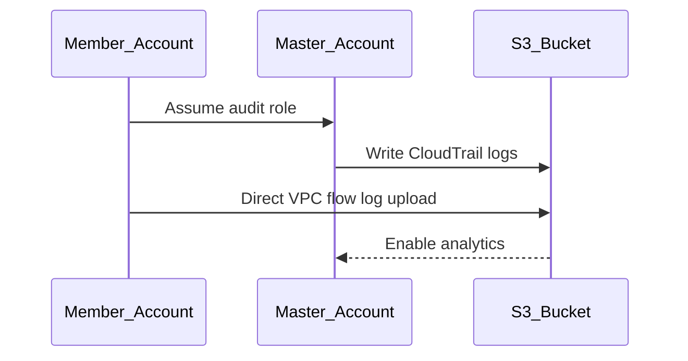

# Terraform AWS Secure Baseline Architecture

## Architecture Overview
The secure-baseline module implements a hub-and-spoke architecture for AWS Organizations, with security services centralized in a master account. Key components include:

```mermaid
componentDiagram
    component Master_Account
    component Member_Accounts
    component Audit_Logs
    component AWS_Services
    
    Master_Account --> Audit_Logs: Centralized logging
    Member_Accounts --> Master_Account: Security configuration
    Master_Account --> AWS_Services: Config/CloudTrail/GuardDuty
    
    note right of Master_Account: Manages:
    - AWS Organizations
    - S3 Audit Bucket
    - Security Hub Aggregator
    - Cross-account IAM Roles
```

## Use Cases
1. **Multi-account Security Baseline Setup**
   - Master account deploys central audit bucket and security services
   - Member accounts inherit configurations through Terraform modules

2. **Compliance Monitoring**
   - AWS Config rules continuously validate resource configurations
   - Security Hub aggregates findings across organization

## System Diagrams

### Audit Log Flow


## Technology Stack
- **Core**: Terraform v1.0+, AWS Provider v4.0+
- **Security Services**: IAM, Config, CloudTrail, GuardDuty, Security Hub
- **Storage**: S3 (audit logs), KMS (encryption)

## Key Design Decisions
1. **Organization-first Approach**: Leverages AWS Organizations for centralized security management
2. **Modular Design**: Reusable components for master/member account configurations
3. **Immutable Infrastructure**: Terraform-managed resources with versioned states