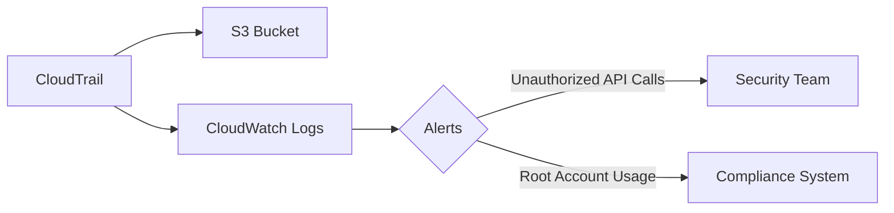

# CloudTrail Baseline Module

## File Overview
Centralizes AWS CloudTrail logging across all regions and integrates with S3/CloudWatch for security monitoring. Ensures trail encryption and log file validation.

## Resources
### aws_cloudtrail (security_trail)
- **Purpose**: Captures API activity across AWS services
- **Parameters**:
  - `name`: "OrganizationTrail"
  - `s3_bucket_name": module.secure-bucket.bucket_id
  - `enable_log_file_validation": true
- **Relationships**: Requires S3 bucket from secure-bucket module

## Use Cases
- Investigate security incidents through API activity history
- Meet compliance requirements for audit trails

