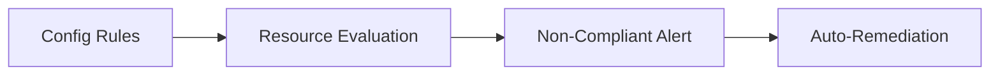

# Config Baseline Module

## File Overview
Manages AWS Config rules for continuous compliance monitoring of security baselines. Implements required controls for resource configuration auditing across AWS services.

## Resources
### aws_config_config_rule (security_standards)
- **Purpose**: Enforces security configuration standards through managed rules
- **Parameters**:
  - `source_identifier`: "REQUIRED_TAGS"
  - `input_parameters": {"tag1Key": "Environment", "tag2Key": "Owner"}
- **Relationships**: Integrates with AWS Security Hub and CloudWatch

## Use Cases
- Automated compliance checks for resource tagging
- Configuration drift detection for security-critical resources

## Dependencies
- IAM roles from `iam-baseline` module
- Notification channels from `sns-baseline`
- Variable definitions in `variables.tf`