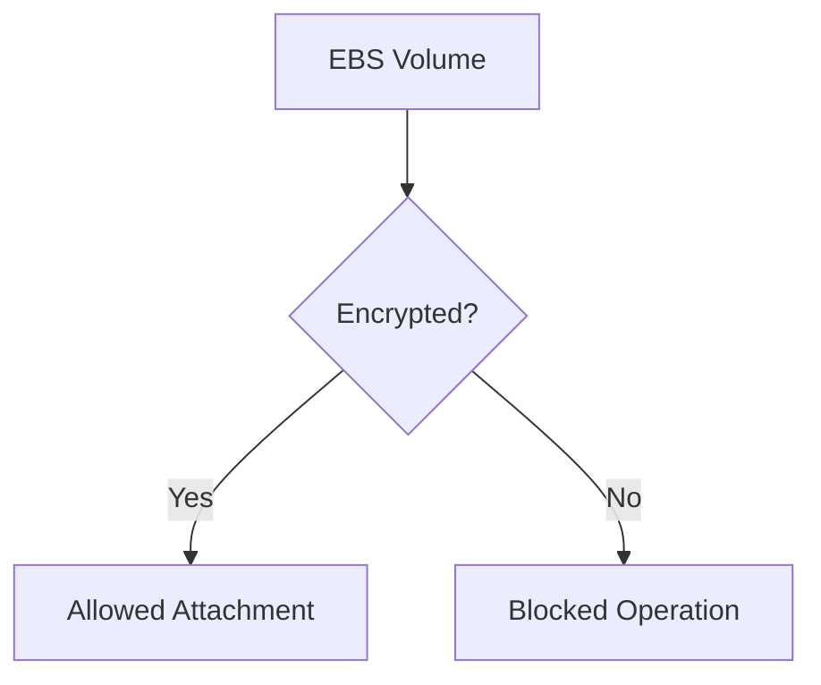

# EBS Baseline Module

## File Overview
Enforces encryption requirements for Elastic Block Store (EBS) volumes across AWS accounts. Implements default encryption settings and monitoring for volume attachments.

## Resources
### aws_ebs_encryption_by_default
- **Purpose**: Enables EBS encryption at the account level
- **Parameters**:
  - `enabled`: true
- **Relationships**: Integrates with AWS KMS for encryption keys

## Use Cases
- Ensure all new EBS volumes are encrypted by default
- Monitor unencrypted volume attachments

## Dependencies
- KMS key from encryption resources
- IAM policies from `iam-baseline` module
- CloudWatch alarms for monitoring