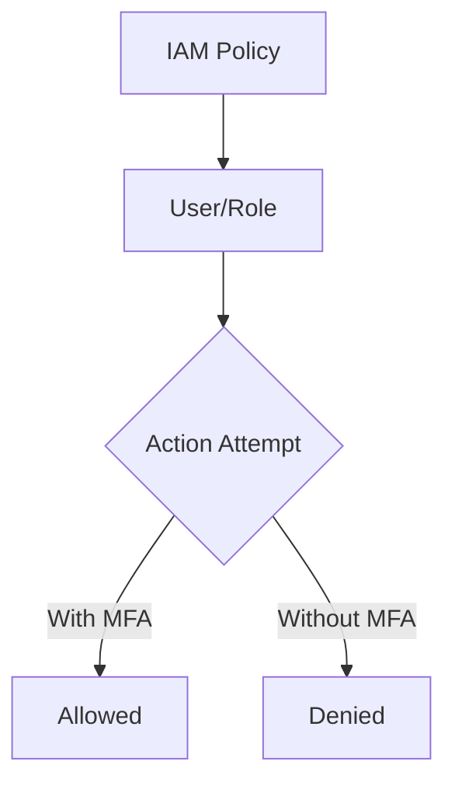

# IAM Baseline Module

## File Overview
Manages AWS Identity and Access Management (IAM) policies and roles for enforcing security best practices. Implements least-privilege access controls and mandatory MFA requirements.

## Resources
### aws_iam_policy (security_baselines)
- **Purpose**: Enforces security policies for users and roles
- **Parameters**:
  - `name": "RequireMFAPolicy"
  - `policy": jsonencode({Version="2012-10-17",...})
- **Relationships**: Applied to IAM users and roles

## Use Cases
- Enforce MFA for privileged accounts
- Restrict root account usage

## Dependencies
- AWS S3 buckets from `secure-bucket`
- CloudTrail configuration from `cloudtrail-baseline`