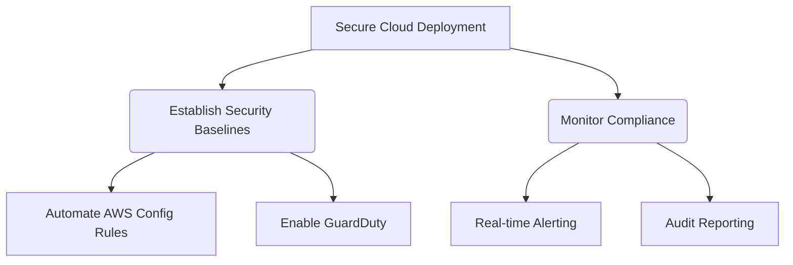

# Jobs to be Done Analysis - AWS Secure Baseline

## Core Job Definition
**When** deploying cloud infrastructure, **I want to** establish secure AWS environments that meet compliance standards **so I can** reduce security risks and accelerate audit readiness.

## Related Jobs
* **Complementary:** When managing cloud security, I want to continuously monitor security controls
* **Supporting:** When implementing security baselines, I want to automate policy enforcement
* **Competing:** When prioritizing development speed, I might accept minimal security configuration

## Desired Outcomes
**Core Job Outcomes:**
1. Reduce initial secure environment setup time from days to <2 hours
2. Achieve 95% compliance with CIS AWS Foundations Benchmark on initial deployment
3. Maintain <24hr remediation time for critical security findings

**Supporting Job Outcomes:**
1. Automate 100% of baseline security controls
2. Generate compliance reports in <5 minutes

## Mermaid Diagrams

